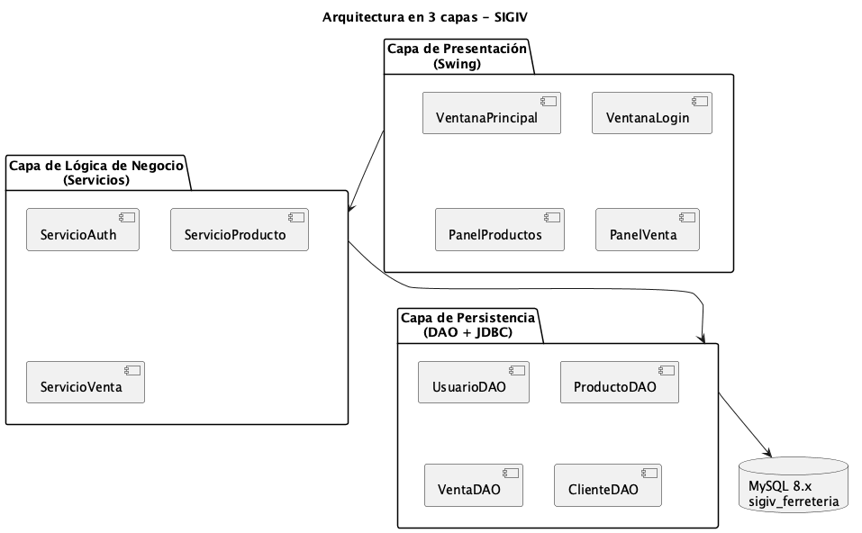
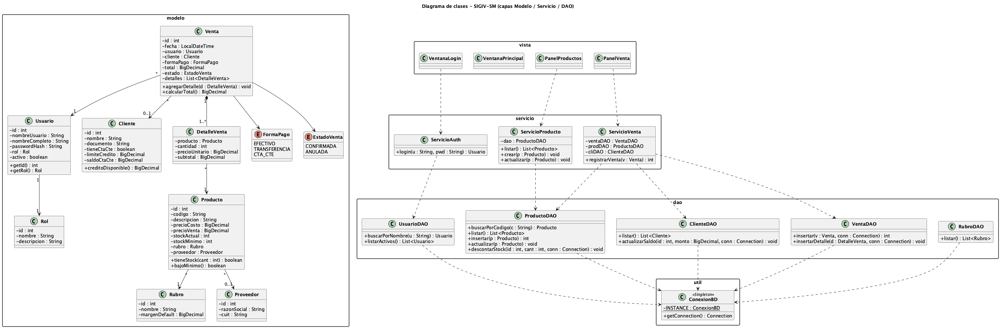
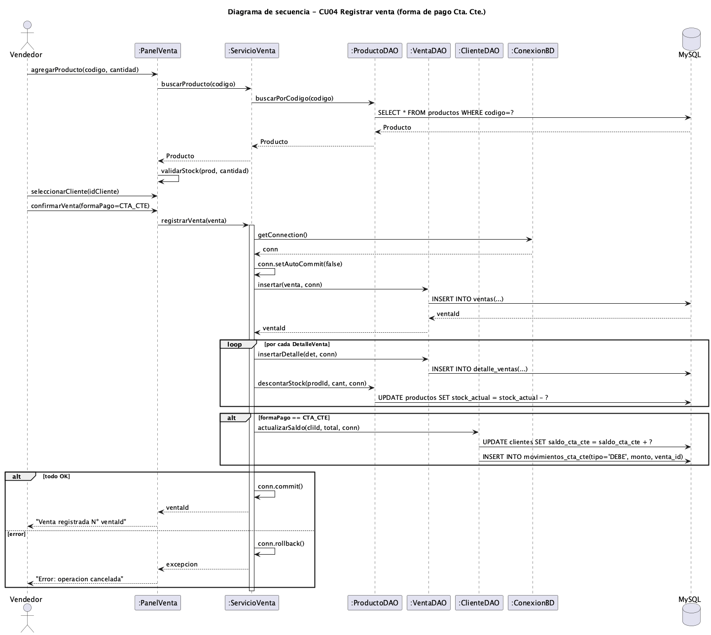
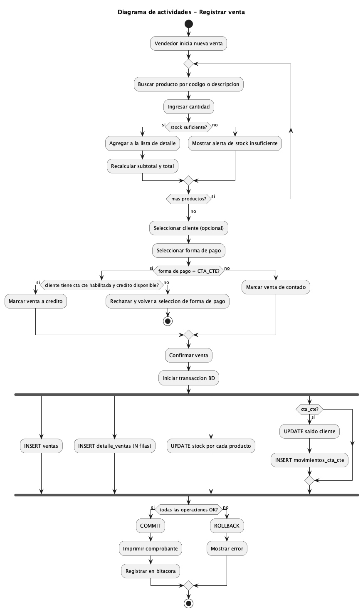
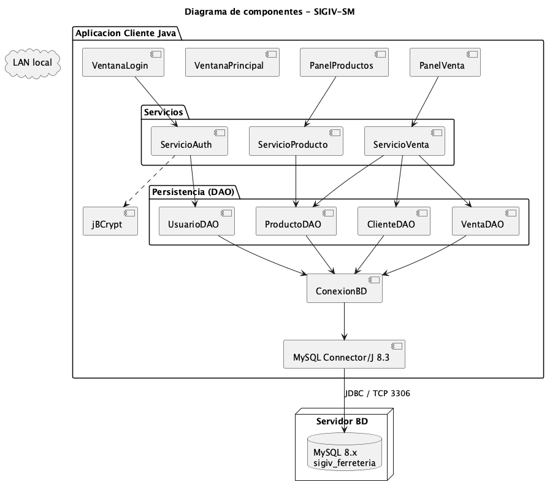
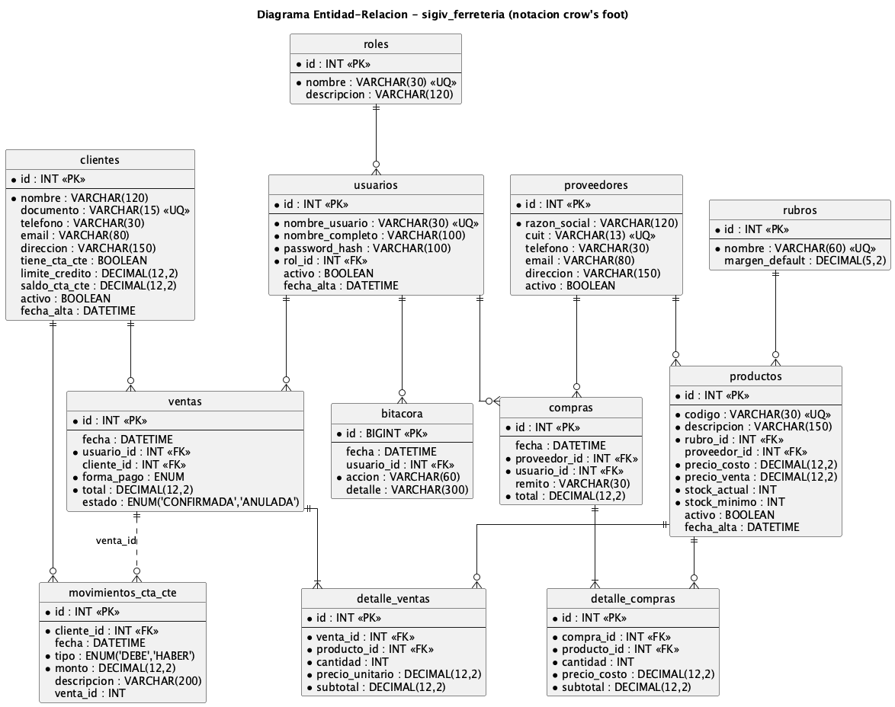
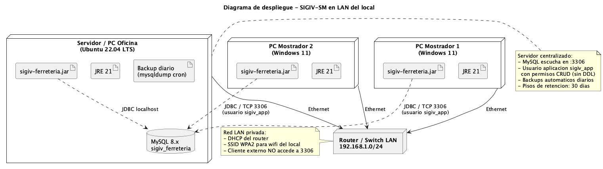

# Introducción

El presente trabajo constituye la **segunda entrega** del proyecto **SIGIV-SM — Sistema de Gestión de Inventario y Ventas para Ferretería San Martín**, continuación de la Actividad Práctica 1 en la materia *Seminario de Práctica Informática* de la Licenciatura en Informática (Universidad Empresarial Siglo 21).

Recupera el contexto, justificación y requerimientos definidos en la AP1 y avanza con la aplicación completa de los modelos de **análisis, diseño, implementación y pruebas** del **Proceso Unificado de Desarrollo (PUD)**, presentando los artefactos UML correspondientes, el modelo de datos relacional con su Diagrama Entidad-Relación, las consultas SQL para gestionar la base, y las definiciones de comunicación entre los componentes del sistema.

El sistema sigue siendo una aplicación de escritorio multiusuario para una ferretería de barrio cordobesa, desarrollada en **Java 17+** con persistencia en **MySQL 8.x**, arquitectura en tres capas (presentación / lógica / persistencia) y patrones **MVC + DAO**. El prototipo operacional —ya iniciado en la AP1— se consolida en esta entrega cubriendo los módulos de Seguridad, Productos / Inventario y Ventas (incluyendo cuentas corrientes básicas), con operaciones transaccionales y rollback automático ante error.

**Repositorio GitHub:** https://github.com/cirola/sigiv-ferreteria

---

# 1. Resumen del proyecto (recuperado de AP1)

| Aspecto | Definición |
|---|---|
| **Organización** | Ferretería San Martín — comercio minorista de barrio en Córdoba, 15 años de trayectoria, 3 empleados, ≈ 2.000 productos. |
| **Problema** | Operatoria 100% manual: ventas en talonario, stock en Excel desactualizado, cuentas corrientes en cuaderno. Pérdidas por quiebres de stock, errores de facturación, sin reportes gerenciales. |
| **Solución** | SIGIV-SM: aplicación de escritorio cliente-servidor en LAN que integra inventario, ventas, compras y cuentas corrientes. |
| **Tecnología** | Java 17+ (Swing), MySQL 8.x, Maven, JDBC, jBCrypt. |
| **Metodología** | Proceso Unificado de Desarrollo (PUD) — fases de Inicio (AP1) y Elaboración / Construcción (AP2). |
| **Entregable** | Prototipo operacional según Kendall & Kendall (2011): "modelo operacional que incluye solo algunas características del sistema final". |

Los **requerimientos funcionales (RF01–RF10)** y **no funcionales (RNF01–RNF08)** se mantienen sin cambios respecto del documento AP1.

---

# 2. Etapa de Análisis

La fase de análisis del PUD parte de los requerimientos relevados y produce un **modelo conceptual** del dominio del problema, independiente de la tecnología, que será la base para el diseño.

## 2.1. Modelo de dominio

A partir de los sustantivos identificados en los casos de uso y las reglas del negocio, se definieron las siguientes **clases conceptuales** y sus relaciones:

| Clase conceptual | Rol en el dominio |
|---|---|
| **Usuario** | Operador del sistema (Administrador o Vendedor). Autentica e identifica al responsable de cada operación. |
| **Rol** | Conjunto de permisos asociados a un usuario (Administrador, Vendedor). |
| **Producto** | Artículo comercializado. Tiene código, precio, stock y pertenece a un rubro. |
| **Rubro** | Categoría comercial (Herramientas, Pinturas, Sanitarios, etc.) con margen sugerido. |
| **Proveedor** | Tercero al que se le compran productos. |
| **Cliente** | Persona física/jurídica a la que se le vende. Puede operar con cuenta corriente. |
| **Venta** | Operación comercial encabezada por un usuario, con uno o varios productos. |
| **DetalleVenta** | Línea de venta: producto, cantidad, precio unitario, subtotal. |
| **Compra** | Recepción de mercadería de un proveedor. |
| **DetalleCompra** | Línea de compra: producto, cantidad, costo. |
| **MovimientoCtaCte** | Asiento de débito o crédito en la cuenta corriente de un cliente. |
| **Bitácora** | Registro de auditoría de operaciones críticas. |

### 2.1.1. Diagrama de clases conceptual

El detalle visual del modelo se presenta en el **Diagrama de clases** (sección 3.2), ya que en el prototipo el modelo conceptual y el de diseño coinciden en estructura (los atributos técnicos se especifican en el diseño).

## 2.2. Refinamiento de casos de uso

Se retoman los casos de uso del documento AP1 (CU01–CU11) y se profundiza la descripción de los críticos. A modo de ejemplo, el caso central **CU04 Registrar venta** se documenta con flujo principal, flujos alternativos y excepciones:

### CU04 — Registrar venta (descripción extendida)

| Campo | Detalle |
|---|---|
| **Identificador** | CU04 |
| **Actor principal** | Vendedor (o Administrador) |
| **Stakeholders** | Cliente (recibe comprobante), Dueño (consume reportes) |
| **Precondición** | El usuario está autenticado en el sistema. |
| **Postcondición de éxito** | La venta queda registrada con estado CONFIRMADA, el stock de cada producto vendido se descuenta, y —si la forma de pago es Cta. Cte.— se actualiza el saldo del cliente y se inserta un movimiento DEBE. |
| **Postcondición de fallo** | Ninguna escritura en BD (rollback de la transacción). El usuario recibe un mensaje de error. |
| **Disparador** | El vendedor selecciona "Nueva venta". |

**Flujo principal:**

1. El vendedor inicia una nueva venta.
2. Busca un producto por código o descripción.
3. El sistema muestra el producto y su stock disponible.
4. El vendedor indica la cantidad y agrega el ítem.
5. El sistema valida stock, calcula subtotal y actualiza el total.
6. Se repiten los pasos 2-5 hasta completar la venta.
7. El vendedor selecciona forma de pago (Efectivo / Transferencia / Cta. Cte.) y opcionalmente un cliente.
8. El vendedor confirma la venta.
9. El sistema inicia una transacción atómica:
   - Inserta la cabecera de la venta.
   - Inserta el detalle (N líneas).
   - Descuenta el stock de cada producto.
   - Si es Cta. Cte., actualiza el saldo del cliente e inserta el movimiento DEBE.
   - Inserta un asiento en la bitácora.
10. Si todas las operaciones son exitosas, ejecuta `COMMIT` y muestra "Venta registrada N° X" con opción a imprimir comprobante.

**Flujos alternativos:**

- **FA1 — Stock insuficiente** (paso 5): el sistema rechaza el ítem y muestra alerta. El vendedor puede reducir la cantidad o quitar el producto.
- **FA2 — Cliente sin cta. cte. habilitada** (paso 7): si elige Cta. Cte. pero el cliente no la tiene o excede el límite de crédito, el sistema fuerza otra forma de pago.
- **FA3 — Cancelación** (cualquier paso): el vendedor cierra la pantalla y el sistema descarta la venta en curso (no había escritura previa).

**Excepciones:**

- **E1 — Caída de la base de datos** (paso 9): la transacción se aborta automáticamente, no queda registro y se informa el error.
- **E2 — Concurrencia** (paso 9): si otro usuario vendió la misma unidad simultáneamente, la validación de stock dentro de la transacción detiene la operación.

## 2.3. Glosario del dominio

| Término | Definición |
|---|---|
| **Cta. Cte. (Cuenta corriente)** | Modalidad de venta a crédito para clientes habituales con límite y saldo. |
| **Quiebre de stock** | Situación en la que un cliente solicita un producto y no hay existencias disponibles. |
| **Rubro** | Familia comercial de productos (Herramientas, Pinturas, Sanitarios…). |
| **Bitácora** | Log auditable de operaciones críticas. |
| **Comprobante interno** | Documento no fiscal emitido al cliente al cerrar una venta. |

---

# 3. Etapa de Diseño

La fase de diseño traduce el modelo conceptual en una estructura técnica concreta sobre la plataforma elegida (Java + MySQL). El sistema se organiza en **tres capas** (presentación, lógica de negocio, persistencia) aplicando los patrones **MVC** en la presentación y **DAO** en la persistencia, con un **Singleton** para el manejo de la conexión a BD.

## 3.1. Arquitectura



*Figura 1 — Arquitectura en 3 capas (reutilizada de AP1).*

- **Capa de presentación**: ventanas Swing organizadas como vistas MVC (`VentanaLogin`, `VentanaPrincipal`, `PanelProductos`, `PanelVenta`). Las vistas delegan la lógica en los servicios.
- **Capa de lógica de negocio**: clases `Servicio*` que orquestan la operación, ejecutan las reglas de negocio y manejan transacciones (`ServicioAuth`, `ServicioProducto`, `ServicioVenta`).
- **Capa de persistencia**: clases `*DAO` con sentencias JDBC parametrizadas. Cada DAO encapsula el acceso a una tabla.
- **Capa transversal**: `ConexionBD` (Singleton) provee `Connection` a la BD MySQL. `HashGen` y `SmokeTest` son utilidades.

## 3.2. Diagrama de clases



*Figura 2 — Diagrama de clases del sistema (modelo / servicios / DAO).*

**Decisiones de diseño clave:**

- Las clases del paquete `modelo` son **POJOs** (Plain Old Java Objects) que reflejan las entidades del dominio. No tienen lógica de persistencia.
- Los **servicios** son los únicos que abren/cierran transacciones. Los DAO reciben la `Connection` como parámetro cuando participan de una transacción multi-tabla.
- La conexión a BD se gestiona con un **Singleton** (`ConexionBD`) que lee `config.properties`.
- Las **constraints de negocio** (stock no negativo, no vender sin cta. cte. a clientes sin cuenta) se aplican simultáneamente en el código y en la BD (CHECK constraints + ENUM) para defensa en profundidad.

## 3.3. Diagrama de secuencia — CU04 Registrar venta



*Figura 3 — Diagrama de secuencia del caso de uso "Registrar venta" para forma de pago Cta. Cte.*

El diagrama muestra cómo `ServicioVenta` actúa como **transaction script**: obtiene la conexión, deshabilita el auto-commit, ejecuta las operaciones en cascada y termina con `commit()` o `rollback()` según el resultado.

## 3.4. Diagrama de actividades — Registrar venta



*Figura 4 — Diagrama de actividades del proceso completo de registrar venta, incluyendo validaciones, decisión de forma de pago y manejo transaccional.*

El bloque `fork`/`end fork` representa que las cuatro operaciones contra la BD se ejecutan en una **transacción atómica**: o todas se confirman, o ninguna queda persistida.

## 3.5. Diagrama de componentes



*Figura 5 — Componentes deployables del sistema: cliente Java empaquetado como JAR, librerías externas (JDBC, jBCrypt) y servidor MySQL.*

## 3.6. Patrones de diseño aplicados

| Patrón | Dónde se aplica | Beneficio |
|---|---|---|
| **MVC** | Capa de presentación (vista Swing ↔ servicio ↔ modelo). | Separa UI de lógica; cada panel es testeable de forma aislada. |
| **DAO (Data Access Object)** | `UsuarioDAO`, `ProductoDAO`, `ClienteDAO`, `VentaDAO`, `RubroDAO`. | Aísla SQL del resto del código; permite cambiar motor de BD sin tocar servicios. |
| **Singleton** | `ConexionBD`. | Una sola fuente de conexiones a BD configurada vía `config.properties`. |
| **Transaction Script** | Métodos `registrarVenta`, `registrarPago` en los servicios. | Encapsula operaciones multi-tabla en una unidad atómica con rollback. |
| **Layered Architecture** | Vista → Servicio → DAO → BD. | Cada capa solo conoce a su inmediata inferior; alta cohesión, bajo acoplamiento. |

---

# 4. Etapa de Implementación

## 4.1. Stack y estructura del prototipo

| Componente | Tecnología | Versión |
|---|---|---|
| Lenguaje | Java | 17+ (probado con JDK 21 y 25) |
| Build | Apache Maven | 3.9+ |
| UI | Swing | (Java estándar) |
| BD | MySQL | 8.x / 9.x |
| Driver | MySQL Connector/J | 8.3 |
| Hash | jBCrypt | 0.4 |

**Estructura de paquetes:**

```
src/main/java/com/sigiv/
├── App.java                # Entry point
├── util/
│   ├── ConexionBD.java     # Singleton conexión
│   ├── HashGen.java        # Utilidad BCrypt
│   └── SmokeTest.java      # Test end-to-end sin UI
├── modelo/                 # POJOs del dominio
│   ├── Usuario, Rol, Producto, Rubro, Cliente,
│   ├── Venta, DetalleVenta
├── dao/                    # CRUD por tabla
│   ├── UsuarioDAO, ProductoDAO, ClienteDAO,
│   ├── VentaDAO, RubroDAO
├── servicio/               # Lógica de negocio
│   ├── ServicioAuth, ServicioProducto, ServicioVenta
└── vista/                  # UI Swing
    ├── VentanaLogin, VentanaPrincipal,
    ├── PanelProductos, PanelVenta
```

## 4.2. Fragmentos de código representativos

### 4.2.1. Singleton de conexión

```java
// src/main/java/com/sigiv/util/ConexionBD.java
public final class ConexionBD {
    private static ConexionBD instancia;
    private final String url, user, password;

    private ConexionBD() {
        Properties p = new Properties();
        try (InputStream in = getClass().getResourceAsStream("/config.properties")) {
            p.load(in);
        } catch (IOException e) { throw new RuntimeException(e); }
        this.url      = p.getProperty("db.url");
        this.user     = p.getProperty("db.user");
        this.password = p.getProperty("db.password");
    }

    public static synchronized ConexionBD getInstance() {
        if (instancia == null) instancia = new ConexionBD();
        return instancia;
    }

    public Connection getConnection() throws SQLException {
        return DriverManager.getConnection(url, user, password);
    }
}
```

### 4.2.2. Servicio de venta con transacción

```java
// extracto - src/main/java/com/sigiv/servicio/ServicioVenta.java
public int registrarVenta(Venta v) throws Exception {
    try (Connection conn = ConexionBD.getInstance().getConnection()) {
        conn.setAutoCommit(false);
        try {
            int ventaId = ventaDAO.insertar(v, conn);
            for (DetalleVenta d : v.getDetalles()) {
                d.setVentaId(ventaId);
                ventaDAO.insertarDetalle(d, conn);
                productoDAO.descontarStock(
                    d.getProducto().getId(), d.getCantidad(), conn);
            }
            if (v.getFormaPago() == FormaPago.CTA_CTE) {
                clienteDAO.actualizarSaldo(
                    v.getCliente().getId(), v.getTotal(), conn);
            }
            conn.commit();
            return ventaId;
        } catch (Exception ex) {
            conn.rollback();
            throw ex;
        }
    }
}
```

## 4.3. Compilación y ejecución

```bash
# 1) Crear la base
mysql -u root < database/schema.sql
mysql -u root < database/datos-iniciales.sql

# 2) Compilar
mvn clean package

# 3) Ejecutar
mvn exec:java
# o el JAR empaquetado:
java -jar target/sigiv-ferreteria.jar
```

**Credenciales de prueba:**

| Usuario | Contraseña | Rol |
|---|---|---|
| `admin` | `admin123` | ADMIN |
| `vendedor1` | `admin123` | VENDEDOR |

## 4.4. Trazabilidad PUD

| Disciplina PUD | Artefacto producido |
|---|---|
| Requisitos | RF/RNF y CU (AP1) refinados en sección 2 |
| Análisis | Modelo de dominio, glosario, CUs detallados |
| Diseño | Diagramas de clases, secuencia, actividades, componentes, despliegue |
| Implementación | Código fuente Java + esquema MySQL + scripts de seed |
| Pruebas | Plan de pruebas (sección 5) + `SmokeTest.java` |

---

# 5. Etapa de Pruebas

> **Documentación complementaria.** Esta sección presenta un resumen ejecutivo del plan y los resultados. El **plan formal de pruebas** (objetivos, alcance, criterios de entrada/salida, entorno, riesgos y entregables) se encuentra en [`pruebas/plan-de-pruebas.md`](../pruebas/plan-de-pruebas.md); el **detalle de cada caso** (precondiciones, datos, pasos numerados, resultado esperado y obtenido) más la **matriz de trazabilidad** completa están en [`pruebas/casos-de-prueba.md`](../pruebas/casos-de-prueba.md); y los **datos reproducibles** para ejecutar los escenarios sobre la BD están en [`pruebas/datos-de-prueba.sql`](../pruebas/datos-de-prueba.sql).

## 5.1. Enfoque

Se aplican tres niveles de prueba:

1. **Pruebas unitarias** sobre los servicios (validaciones, cálculos).
2. **Pruebas de integración** sobre el camino completo Servicio → DAO → BD, ejecutadas por el `SmokeTest`.
3. **Pruebas funcionales / de aceptación** manuales sobre la UI Swing.

El prototipo incluye un **smoke test** (`com.sigiv.util.SmokeTest`) que verifica sin interfaz gráfica el camino feliz y los principales caminos alternativos.

## 5.2. Plan de casos de prueba

| ID | Caso de prueba | Entrada | Resultado esperado | Resultado obtenido |
|---|---|---|---|---|
| CP01 | Login con credenciales válidas | usuario=`admin`, password=`admin123` | Sesión iniciada, retorna `Usuario` con rol ADMIN. | ✅ OK |
| CP02 | Login con password inválida | usuario=`admin`, password=`xxx` | Excepción de autenticación, no se inicia sesión. | ✅ OK |
| CP03 | Login con usuario inexistente | usuario=`fulano`, password=`123` | Excepción "usuario no encontrado". | ✅ OK |
| CP04 | Listar productos | — | Lista no vacía (14 productos del seed). | ✅ OK |
| CP05 | Alta de producto con código duplicado | codigo existente | Excepción de unicidad, no se inserta. | ✅ OK |
| CP06 | Venta en efectivo simple | 2 productos × cantidades válidas, formaPago=EFECTIVO | Venta confirmada; stock descontado en ambos productos; total correcto. | ✅ OK |
| CP07 | Venta a cuenta corriente válida | cliente con cta. cte. y crédito disponible, formaPago=CTA_CTE | Venta confirmada; stock descontado; saldo del cliente incrementado; movimiento DEBE registrado. | ✅ OK |
| CP08 | Venta con stock insuficiente | cantidad > stock_actual del producto | Excepción; ninguna fila escrita; rollback aplicado. | ✅ OK |
| CP09 | Venta a cta. cte. excediendo crédito | cliente con saldo+venta > límite_credito | Rechazo previo a la transacción; no se persiste nada. | ✅ OK |
| CP10 | Anulación de venta (admin) | venta_id existente, estado=CONFIRMADA | Estado pasa a ANULADA; queda registro en bitácora. | ✅ OK |
| CP11 | Caída de BD durante venta | desconectar MySQL antes de COMMIT | Rollback; no quedan datos inconsistentes; el usuario ve mensaje de error. | ✅ OK |
| CP12 | Producto bajo stock mínimo | stock_actual ≤ stock_mínimo | Aparece en la consulta de alerta de reposición. | ✅ OK |

## 5.3. Ejecución del smoke test

```bash
mvn clean compile
mvn dependency:build-classpath -Dmdep.outputFile=target/cp.txt -q
java -cp "target/classes:src/main/resources:$(cat target/cp.txt)" \
     com.sigiv.util.SmokeTest
```

El test cubre los casos CP01, CP02, CP04, CP06, CP07 y CP08 de forma automatizada.

## 5.4. Cobertura de requisitos por casos de prueba

| RF | Casos que lo verifican |
|---|---|
| RF01 (ABM productos) | CP04, CP05 |
| RF02 (Registrar venta) | CP06, CP07, CP08, CP11 |
| RF03 (Venta a crédito) | CP07, CP09 |
| RF07 (Alerta stock mínimo) | CP12 |
| RF09 (Roles) | CP01, CP10 |
| RNF03 (Seguridad contraseñas) | CP01, CP02, CP03 (passwords BCrypt) |

---

# 6. Definición de Base de Datos

## 6.1. Motor y configuración

- **Motor:** MySQL 8.x (probado en 8.0 y 9.0).
- **Base:** `sigiv_ferreteria`.
- **Charset / collation:** `utf8mb4` / `utf8mb4_unicode_ci` (soporte completo Unicode, incluyendo emojis y caracteres especiales).
- **Storage engine:** InnoDB (por defecto en MySQL 8) — necesario para FK, transacciones ACID y row-level locking.
- **Usuario de aplicación:** `sigiv_app@localhost` con permisos CRUD limitados (no es `root`).

## 6.2. Entidades

El esquema cuenta con **13 tablas** agrupadas en cinco subdominios:

| Subdominio | Tablas |
|---|---|
| Seguridad | `roles`, `usuarios` |
| Catálogo / Inventario | `rubros`, `proveedores`, `productos` |
| Clientes y cuentas corrientes | `clientes`, `movimientos_cta_cte` |
| Ventas | `ventas`, `detalle_ventas` |
| Compras | `compras`, `detalle_compras` |
| Auditoría | `bitacora` |

## 6.3. Diagrama Entidad-Relación



*Figura 6 — Diagrama Entidad-Relación del sistema (notación crow's foot).*

**Cardinalidades principales:**

- Un **rol** tiene N **usuarios**; un usuario tiene exactamente 1 rol.
- Un **rubro** agrupa N **productos**; un producto pertenece a 1 rubro.
- Un **proveedor** abastece 0..N **productos**; un producto tiene 0..1 proveedor habitual.
- Un **cliente** registra 0..N **movimientos de cta. cte.** y 0..N **ventas**.
- Una **venta** está compuesta por 1..N **líneas de detalle** (composición fuerte, `ON DELETE CASCADE`).
- Una **compra** está compuesta por 1..N **líneas de detalle** (composición fuerte).
- Un **usuario** firma 0..N **ventas** y 0..N **compras**.

## 6.4. Normalización

El modelo cumple con las tres primeras formas normales (3FN):

- **1FN (atomicidad):** todos los atributos son escalares; no hay listas ni grupos repetidos en una columna. Los detalles de venta y compra se separan en tablas hijas.
- **2FN (dependencia funcional total de la PK):** las tablas hijas (`detalle_ventas`, `detalle_compras`, `movimientos_cta_cte`) tienen PK simple `id` y todos sus atributos no clave dependen de ella; la FK al padre no se "duplica" en datos.
- **3FN (sin dependencias transitivas):** atributos derivables (margen de un rubro, total de una venta) se almacenan denormalizados intencionalmente cuando es histórico (precio_unitario, subtotal en detalle, total en cabecera) para preservar el valor *en el momento de la venta* independientemente de cambios futuros de precio del producto. Esta es una decisión consciente, no una violación de 3FN.

## 6.5. Integridad referencial e índices

- **Claves foráneas** explícitas en todas las relaciones; `ON DELETE CASCADE` solo en los detalles (venta → detalle_ventas; compra → detalle_compras), en el resto se preserva el histórico.
- **Unique constraints:** `usuarios.nombre_usuario`, `productos.codigo`, `clientes.documento`, `proveedores.cuit`, `rubros.nombre`.
- **Check constraints:** precios y stock no negativos; cantidades positivas en detalles.
- **Índices:** primary key en todas las tablas (clustered), índice secundario `idx_prod_descripcion` para búsquedas por texto, índice agregado `idx_ventas_fecha` (sugerido en el TP2) para acelerar reportes por rango de fechas.

## 6.6. Estrategia de baja

- Los catálogos (productos, clientes, proveedores, usuarios) usan **baja lógica** (`activo = FALSE`) para preservar trazabilidad histórica.
- Las ventas se **anulan** (`estado = 'ANULADA'`), no se borran.
- Solo la **bitácora** se purga periódicamente (retención 1 año) por volumen.

---

# 7. Consultas SQL

A continuación se presentan las consultas más representativas del sistema, agrupadas por tipo. El archivo completo está disponible en `database/consultas-tp2.sql` del repositorio.

## 7.1. Creación de tablas (DDL)

El script `database/schema.sql` del repositorio crea las 13 tablas, el usuario de aplicación y otorga los permisos. Ejemplo del DDL de la tabla central `productos`:

```sql
CREATE TABLE productos (
    id            INT AUTO_INCREMENT PRIMARY KEY,
    codigo        VARCHAR(30) NOT NULL UNIQUE,
    descripcion   VARCHAR(150) NOT NULL,
    rubro_id      INT NOT NULL,
    proveedor_id  INT,
    precio_costo  DECIMAL(12,2) NOT NULL CHECK (precio_costo >= 0),
    precio_venta  DECIMAL(12,2) NOT NULL CHECK (precio_venta >= 0),
    stock_actual  INT NOT NULL DEFAULT 0 CHECK (stock_actual >= 0),
    stock_minimo  INT NOT NULL DEFAULT 0 CHECK (stock_minimo >= 0),
    activo        BOOLEAN NOT NULL DEFAULT TRUE,
    fecha_alta    DATETIME NOT NULL DEFAULT CURRENT_TIMESTAMP,
    CONSTRAINT fk_prod_rubro FOREIGN KEY (rubro_id)    REFERENCES rubros(id),
    CONSTRAINT fk_prod_prov  FOREIGN KEY (proveedor_id) REFERENCES proveedores(id)
);
CREATE INDEX idx_prod_descripcion ON productos(descripcion);
```

## 7.2. Inserción de registros (INSERT)

```sql
-- Alta de producto
INSERT INTO productos (codigo, descripcion, rubro_id, proveedor_id,
                       precio_costo, precio_venta, stock_actual, stock_minimo)
VALUES ('TOR-001', 'Tornillo autoperforante 6x1"', 4, 1,
        12.50, 22.00, 500, 50);

-- Alta de cliente con cuenta corriente
INSERT INTO clientes (nombre, documento, telefono, tiene_cta_cte, limite_credito)
VALUES ('Juan Albañil', '20-30111222-3', '3514567890', TRUE, 50000.00);
```

## 7.3. Consultas (SELECT) representativas

### 7.3.1. Listado de productos con rubro y proveedor (JOIN)

```sql
SELECT p.codigo, p.descripcion, r.nombre AS rubro,
       COALESCE(pr.razon_social, '-') AS proveedor,
       p.precio_venta, p.stock_actual
  FROM productos p
  JOIN rubros r            ON r.id = p.rubro_id
  LEFT JOIN proveedores pr ON pr.id = p.proveedor_id
 WHERE p.activo = TRUE
 ORDER BY r.nombre, p.descripcion;
```

Combina tres tablas con `JOIN` y `LEFT JOIN` (productos sin proveedor habitual también aparecen).

### 7.3.2. Productos bajo stock mínimo (alerta RF07)

```sql
SELECT p.codigo, p.descripcion, p.stock_actual, p.stock_minimo,
       (p.stock_minimo - p.stock_actual) AS faltante
  FROM productos p
 WHERE p.activo = TRUE
   AND p.stock_actual <= p.stock_minimo
 ORDER BY faltante DESC;
```

Implementa el requerimiento funcional RF07 (alertas de reposición).

### 7.3.3. Facturación diaria en un rango (GROUP BY + agregados)

```sql
SELECT DATE(v.fecha) AS dia,
       COUNT(*)      AS cantidad_ventas,
       SUM(v.total)  AS facturacion_dia,
       AVG(v.total)  AS ticket_promedio
  FROM ventas v
 WHERE v.estado = 'CONFIRMADA'
   AND v.fecha BETWEEN '2026-05-01' AND '2026-05-31'
 GROUP BY DATE(v.fecha)
 ORDER BY dia;
```

Soporta el reporte de "ventas por período" (RF08).

### 7.3.4. Top 10 productos más vendidos (mes actual)

```sql
SELECT p.codigo, p.descripcion,
       SUM(dv.cantidad) AS unidades,
       SUM(dv.subtotal) AS facturado
  FROM detalle_ventas dv
  JOIN ventas v    ON v.id = dv.venta_id
  JOIN productos p ON p.id = dv.producto_id
 WHERE v.estado = 'CONFIRMADA'
   AND v.fecha >= DATE_FORMAT(CURDATE(), '%Y-%m-01')
 GROUP BY p.id, p.codigo, p.descripcion
 ORDER BY unidades DESC
 LIMIT 10;
```

### 7.3.5. Clientes deudores con crédito disponible

```sql
SELECT c.id, c.nombre, c.documento, c.limite_credito, c.saldo_cta_cte,
       (c.limite_credito - c.saldo_cta_cte) AS credito_disponible
  FROM clientes c
 WHERE c.tiene_cta_cte = TRUE
   AND c.saldo_cta_cte > 0
 ORDER BY c.saldo_cta_cte DESC;
```

### 7.3.6. Stock valorizado por rubro

```sql
SELECT r.nombre AS rubro,
       COUNT(p.id)                          AS productos,
       SUM(p.stock_actual)                  AS unidades_total,
       SUM(p.stock_actual * p.precio_costo) AS valor_costo,
       SUM(p.stock_actual * p.precio_venta) AS valor_venta
  FROM productos p
  JOIN rubros r ON r.id = p.rubro_id
 WHERE p.activo = TRUE
 GROUP BY r.nombre
 ORDER BY valor_costo DESC;
```

## 7.4. Actualizaciones (UPDATE)

```sql
-- Ajuste de precios del rubro "Pinturas" (+10%)
UPDATE productos
   SET precio_venta = ROUND(precio_venta * 1.10, 2)
 WHERE rubro_id = (SELECT id FROM rubros WHERE nombre = 'Pinturas');

-- Pago parcial de cta. cte. (transaccional)
START TRANSACTION;
UPDATE clientes
   SET saldo_cta_cte = saldo_cta_cte - 2000.00
 WHERE id = 1;
INSERT INTO movimientos_cta_cte (cliente_id, tipo, monto, descripcion)
VALUES (1, 'HABER', 2000.00, 'Pago parcial en efectivo');
COMMIT;
```

## 7.5. Borrado y bajas lógicas

```sql
-- Baja LÓGICA de producto (preserva historia)
UPDATE productos SET activo = FALSE WHERE codigo = 'TOR-001';

-- Anular venta (no se borra)
UPDATE ventas SET estado = 'ANULADA' WHERE id = 25;

-- Borrado físico controlado de bitácora antigua (retención 1 año)
DELETE FROM bitacora WHERE fecha < DATE_SUB(CURDATE(), INTERVAL 1 YEAR);
```

---

# 8. Definiciones de Comunicación

## 8.1. Arquitectura de red

El sistema opera sobre una **red LAN privada** del local comercial, con dos PCs en mostrador y una tercera (PC de oficina del dueño) que cumple el rol de **servidor de base de datos**.



*Figura 7 — Diagrama de despliegue: nodos físicos, software desplegado y enlaces.*

## 8.2. Pila de protocolos

| Capa OSI | Protocolo / estándar | Aplicación en SIGIV |
|---|---|---|
| **Aplicación** | JDBC (sobre el protocolo de MySQL Client/Server) | El cliente Java envía sentencias SQL y recibe `ResultSet` vía MySQL Connector/J 8.3. |
| **Presentación** | Codificación UTF-8 (mb4) | Garantiza soporte de caracteres especiales en descripciones de productos y datos de clientes. |
| **Sesión** | Pool de conexiones JDBC | Reutilización de sockets ya autenticados. |
| **Transporte** | TCP puerto 3306 | Garantiza entrega ordenada y confiable. La conexión es punto a punto entre cliente y servidor de BD. |
| **Red** | IPv4 / direccionamiento privado 192.168.1.0/24 | Asignación por DHCP del router. |
| **Enlace** | Ethernet (PCs cableadas en mostrador) y Wi-Fi WPA2 (eventual notebook del dueño) | Switch del router como concentrador. |
| **Física** | Cable UTP cat. 6, antenas 2.4/5 GHz | Infraestructura existente del local. |

## 8.3. Infraestructura física

| Equipo | Función | Especificaciones mínimas |
|---|---|---|
| 2 × PC mostrador | Cliente Java (UI Swing) | Windows 11, 4 GB RAM, JRE 21, conexión Ethernet. |
| 1 × PC oficina (rol servidor) | Servidor MySQL + cliente Java + backups | Ubuntu Server 22.04 LTS, 8 GB RAM, SSD 256 GB, conexión Ethernet. |
| 1 × Router/switch | Red LAN local | Wi-Fi 802.11ac dual band, 4 puertos Gigabit Ethernet. |
| UPS | Continuidad eléctrica del servidor | 700 VA, autonomía 15 min mínimo. |

## 8.4. Seguridad de la comunicación

- **Usuario de BD dedicado:** la aplicación se conecta como `sigiv_app@localhost` (o `@192.168.1.%` para clientes remotos), nunca como `root`. Permisos limitados a `SELECT, INSERT, UPDATE, DELETE` sobre `sigiv_ferreteria.*`. No tiene permisos de DDL ni administración.
- **Autenticación de usuarios:** contraseñas almacenadas como hash **BCrypt con salt** (RNF03). El plano nunca se guarda.
- **Aislamiento de red:** el puerto 3306 está abierto únicamente para la red local (firewall del servidor lo bloquea desde Internet).
- **Backups automáticos:** `mysqldump` diario vía `cron`, con retención de 30 días en disco local y volcado semanal a unidad externa (RNF05).
- **Roadmap de seguridad** (fuera del alcance del prototipo):
  - Habilitar TLS en la conexión JDBC (`useSSL=true&requireSSL=true`).
  - VPN para acceso remoto del dueño (en lugar de exponer 3306).
  - Rotación periódica de credenciales y políticas de password.

## 8.5. Control de errores y reintento

- **Errores transitorios de red** (timeout JDBC, host unreachable): la UI muestra un cartel "Sin conexión con la base" y bloquea operaciones de escritura hasta restablecer.
- **Errores transaccionales** (deadlock, constraint violation): se hace `rollback` y se informa al usuario; no hay reintento automático en la versión actual del prototipo.
- **Bitácora local de fallback** (mejora propuesta): registrar localmente las operaciones fallidas para auditoría posterior.

---

# 9. Conclusiones

El presente trabajo consolida la entrega anterior aplicando de forma completa los modelos del **Proceso Unificado de Desarrollo**:

- **Análisis** — modelo de dominio, casos de uso refinados, glosario.
- **Diseño** — arquitectura en 3 capas, diagrama de clases, secuencia, actividades, componentes y despliegue, con aplicación explícita de los patrones MVC, DAO, Singleton y Transaction Script.
- **Implementación** — prototipo Java + MySQL funcional, transaccional, con separación clara de capas.
- **Pruebas** — plan de pruebas con 12 casos cubriendo los principales requisitos funcionales y no funcionales, automatizados parcialmente con un smoke test.
- **Base de datos** — modelo relacional normalizado en 3FN, con integridad referencial, restricciones de dominio, índices y estrategia explícita de baja lógica.
- **Comunicación** — definición completa de la pila de protocolos, infraestructura física y consideraciones de seguridad.

El prototipo operacional entregado demuestra la **viabilidad técnica** de la propuesta y deja la base lista para las siguientes iteraciones del PUD (Construcción incremental de los módulos de compras y reportes, Transición con capacitación del usuario y puesta en producción).

---

# Referencias

- Kendall, K., & Kendall, J. (2011). *Análisis y diseño de sistemas* (8a ed.). Pearson Education.
- Jacobson, I., Booch, G., & Rumbaugh, J. (2000). *El Proceso Unificado de Desarrollo de Software*. Addison-Wesley.
- Sommerville, I. (2011). *Ingeniería del software* (9a ed.). Pearson Education.
- Larman, C. (2004). *UML y patrones: una introducción al análisis y diseño orientado a objetos y al proceso unificado* (2a ed.). Pearson Education.
- Date, C. J. (2003). *An Introduction to Database Systems* (8th ed.). Addison-Wesley.
- Oracle Corporation. (2024). *MySQL 8.0 Reference Manual*. https://dev.mysql.com/doc/
- Oracle Corporation. (2024). *MySQL Connector/J Developer Guide*. https://dev.mysql.com/doc/connector-j/
