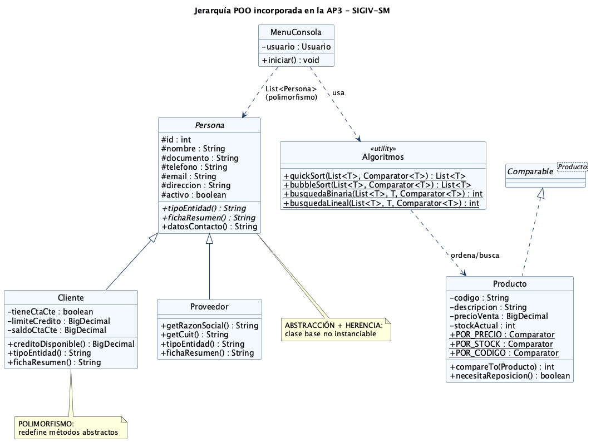
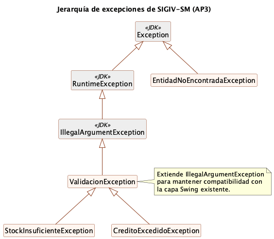

# Introducción

El presente trabajo constituye la **tercera entrega** del proyecto **SIGIV-SM — Sistema de Gestión de Inventario y Ventas para Ferretería San Martín**, dando continuidad a las actividades prácticas AP1 (análisis del modelo de negocio, requerimientos y casos de uso) y AP2 (modelos de análisis, diseño, implementación y pruebas del Proceso Unificado de Desarrollo, base de datos MySQL y definiciones de comunicación) de la materia *Seminario de Práctica Informática* de la Licenciatura en Informática (Universidad Empresarial Siglo 21).

Mientras que las entregas anteriores se concentraron en *qué* construir y *cómo estructurarlo*, esta actividad profundiza en la **aplicación concreta de la Programación Orientada a Objetos (POO) sobre el lenguaje Java**. El objetivo es evidenciar, sobre el mismo prototipo operacional, los cuatro pilares del paradigma —**encapsulamiento, herencia, polimorfismo y abstracción**— junto con las características esenciales del lenguaje: tipos de datos, estructuras de control, manejo de excepciones, declaración y creación de objetos, uso de constructores, un menú de selección y algoritmos de ordenación y búsqueda.

Siguiendo la lógica de **entrega incremental** del PUD, no se reescribió el sistema: se **extendió el prototipo existente** agregando los artefactos de software necesarios para demostrar estos conceptos, cuidando que el código previo (interfaz gráfica Swing y módulos de Seguridad, Inventario y Ventas) siga compilando y ejecutándose sin cambios de comportamiento.

**Repositorio GitHub:** https://github.com/cirola/sigiv-ferreteria

---

# 1. Contexto del proyecto (síntesis)

| Aspecto | Definición |
|---|---|
| **Organización** | Ferretería San Martín — comercio minorista de barrio en Córdoba, 15 años de trayectoria, 3 empleados, ≈ 2.000 productos. |
| **Problema** | Operatoria manual: ventas en talonario, stock en planillas desactualizadas y cuentas corrientes en cuaderno, con quiebres de stock, errores de facturación y ausencia de reportes. |
| **Solución** | SIGIV-SM: aplicación de escritorio que integra inventario, ventas y cuentas corrientes, con persistencia en MySQL. |
| **Tecnología** | Java 17+ (probado en JDK 21), MySQL 8/9, Maven, JDBC, Swing, jBCrypt. |
| **Arquitectura** | Tres capas (presentación / lógica de negocio / persistencia) con patrones MVC, DAO y Singleton (definidos en AP2). |
| **Entregable** | Prototipo operacional según Kendall & Kendall (2011): "modelo operacional que incluye solo algunas características del sistema final". |

La AP3 se inscribe en la disciplina de **Implementación** del PUD, agregando una iteración de construcción centrada en la calidad del diseño orientado a objetos.

---

# 2. Estructura del prototipo

El sistema se organiza en paquetes Java que reflejan la arquitectura en capas. Las **incorporaciones de la AP3** se señalan con ⭐.

```
src/main/java/com/sigiv/
├── App.java                    Punto de entrada (Swing o --consola) ⭐ modificado
├── modelo/                     Entidades del dominio
│   ├── Persona.java            ⭐ clase ABSTRACTA (base de la jerarquía)
│   ├── Cliente.java            ⭐ ahora extends Persona
│   ├── Proveedor.java          ⭐ nueva, extends Persona
│   ├── Producto.java           ⭐ implements Comparable + Comparators
│   ├── Usuario.java, Rol.java, Rubro.java, Venta.java, DetalleVenta.java
├── excepcion/                  ⭐ excepciones de negocio (nuevo paquete)
│   ├── ValidacionException.java
│   ├── StockInsuficienteException.java
│   ├── CreditoExcedidoException.java
│   └── EntidadNoEncontradaException.java
├── dao/                        Persistencia (patrón DAO)
│   ├── ProveedorDAO.java       ⭐ nuevo
│   ├── ProductoDAO, ClienteDAO, UsuarioDAO, VentaDAO, RubroDAO
├── servicio/                   Lógica de negocio
│   ├── ServicioAuth, ServicioProducto ⭐, ServicioVenta ⭐
├── util/
│   ├── Algoritmos.java         ⭐ ordenación y búsqueda genéricas
│   ├── ConexionBD.java, HashGen.java, SmokeTest.java
├── consola/                    ⭐ interfaz por consola (nuevo paquete)
│   ├── MenuConsola.java        menú de selección
│   └── DemoPOO.java            demostración autónoma (sin BD)
└── vista/                      Interfaz gráfica Swing (AP1/AP2, sin cambios)
```

---

# 3. Los cuatro pilares de la POO

A continuación se explica **dónde y cómo** se aplica cada pilar, con el fragmento de código representativo. El siguiente diagrama de clases resume la jerarquía incorporada.



*Figura 1 — Clases incorporadas en la AP3: la jerarquía `Persona` y su relación con los algoritmos genéricos y el menú de consola.*

## 3.1. Abstracción

La **abstracción** consiste en modelar el concepto esencial de un objeto exponiendo *qué hace* y ocultando *cómo lo hace*. Se materializa en la clase **abstracta** `Persona`, que captura lo común a toda entidad de contacto del sistema (clientes y proveedores) pero **no puede instanciarse**: obliga a las subclases a completar el comportamiento mediante **métodos abstractos**.

```java
public abstract class Persona {
    protected int id;
    protected String nombre;
    protected String documento;
    // ... telefono, email, direccion, activo

    /** Cada subclase declara su tipo (base del polimorfismo). */
    public abstract String tipoEntidad();

    /** Ficha resumida específica de cada subclase. */
    public abstract String fichaResumen();

    /** Método CONCRETO heredado por todas las subclases. */
    public String datosContacto() {
        return String.format("Tel: %s | Email: %s",
            telefono != null ? telefono : "-",
            email != null ? email : "-");
    }
}
```

El programa nunca trabaja con un "objeto Persona genérico" creado directamente; trabaja con `Cliente` o `Proveedor`, pero puede tratarlos *a través* del contrato abstracto.

## 3.2. Herencia

La **herencia** permite que una clase reutilice y especialice el estado y el comportamiento de otra. `Cliente` y `Proveedor` **extienden** `Persona`: heredan todos sus atributos y métodos, e invocan el constructor de la superclase con `super(...)`.

```java
public class Cliente extends Persona {
    private boolean tieneCtaCte;
    private BigDecimal limiteCredito = BigDecimal.ZERO;
    private BigDecimal saldoCtaCte   = BigDecimal.ZERO;

    public Cliente(int id, String nombre, String documento, String telefono,
                   String email, String direccion, boolean tieneCtaCte,
                   BigDecimal limiteCredito, BigDecimal saldoCtaCte) {
        super(id, nombre, documento, telefono, email, direccion); // herencia
        this.tieneCtaCte   = tieneCtaCte;
        this.limiteCredito = limiteCredito;
        this.saldoCtaCte   = saldoCtaCte;
    }

    public BigDecimal creditoDisponible() {       // regla propia del cliente
        return limiteCredito.subtract(saldoCtaCte);
    }
}
```

`Proveedor` reutiliza la misma base y agrega *alias semánticos* (`getRazonSocial()`, `getCuit()`) sobre los atributos heredados, dado que en su contexto el "nombre" es la razón social y el "documento" es el CUIT.

La herencia se aplica también a la **jerarquía de excepciones** (sección 5).

## 3.3. Polimorfismo

El **polimorfismo** (del griego "muchas formas") permite que una misma llamada produzca comportamientos distintos según el tipo real del objeto en tiempo de ejecución. En SIGIV se aplica de dos maneras:

**a) Sobrescritura de métodos (polimorfismo de subtipos).** `Cliente` y `Proveedor` redefinen los métodos abstractos:

```java
// En Cliente
@Override public String tipoEntidad() { return "CLIENTE"; }
@Override public String fichaResumen() {
    return tieneCtaCte
        ? String.format("%s | Cta.Cte: saldo $%s / límite $%s (disp. $%s)",
              nombre, saldoCtaCte, limiteCredito, creditoDisponible())
        : nombre + " | Contado";
}

// En Proveedor
@Override public String tipoEntidad() { return "PROVEEDOR"; }
@Override public String fichaResumen() {
    return String.format("%s | CUIT %s | %s", nombre, documento, datosContacto());
}
```

La "agenda de contactos" del menú recorre una **lista heterogénea** `List<Persona>` y llama a los mismos métodos sin saber el tipo concreto; Java resuelve cuál ejecutar:

```java
List<Persona> contactos = new ArrayList<>();
contactos.addAll(clienteDAO.listar());     // Clientes
contactos.addAll(proveedorDAO.listar());   // Proveedores
for (Persona persona : contactos) {
    System.out.printf("[%s] %s%n", persona.tipoEntidad(), persona.fichaResumen());
}
```

**b) Polimorfismo paramétrico (genéricos + `Comparator`).** Los algoritmos de la sección 6 reciben un `Comparator<T>` y ordenan/buscan por el criterio que se les pase, sin conocer el tipo. `Producto` expone varias estrategias:

```java
public static final Comparator<Producto> POR_PRECIO =
        Comparator.comparing(Producto::getPrecioVenta);
public static final Comparator<Producto> POR_STOCK =
        Comparator.comparingInt(Producto::getStockActual);
```

## 3.4. Encapsulamiento

El **encapsulamiento** protege el estado interno de un objeto: los atributos son privados/protegidos y el acceso se realiza por métodos públicos controlados (getters/setters), nunca por manipulación directa desde otra capa. Todas las entidades del dominio lo aplican; además, la validación de reglas se concentra en los métodos en lugar de quedar dispersa.

```java
public BigDecimal getSaldoCtaCte() { return saldoCtaCte; }
public void setSaldoCtaCte(BigDecimal v) { this.saldoCtaCte = v; }

public BigDecimal creditoDisponible() {   // lógica encapsulada en el objeto
    return limiteCredito.subtract(saldoCtaCte);
}
```

El encapsulamiento se extiende a las capas: la presentación (Swing o consola) **no accede a la base de datos**; delega en los **servicios**, que a su vez delegan en los **DAO**. Cada capa expone una interfaz y oculta su implementación.

| Pilar | Artefacto principal | Mecanismo Java |
|---|---|---|
| Abstracción | `Persona` | `abstract class`, métodos `abstract` |
| Herencia | `Cliente`, `Proveedor` | `extends`, `super(...)` |
| Polimorfismo | Agenda de contactos, `Algoritmos` | `@Override`, genéricos `<T>`, `Comparator` |
| Encapsulamiento | Todas las entidades y capas | atributos privados + getters/setters |

---

# 4. Características del lenguaje Java aplicadas

## 4.1. Tipos de datos

Se emplean tipos acordes a la semántica del dato:

- **Primitivos:** `int` (identificadores, stock, cantidades), `boolean` (banderas como `activo`, `tieneCtaCte`).
- **Objetos:** `String` (textos), `BigDecimal` para importes monetarios (evita los errores de redondeo de `double`, crítico en cálculos de dinero), `LocalDateTime` para fechas.
- **Enumerados (`enum`):** `Rol {ADMIN, VENDEDOR}`, `Venta.FormaPago {EFECTIVO, TRANSFERENCIA, CTA_CTE}` y `Venta.Estado {CONFIRMADA, ANULADA}`, que restringen los valores válidos en tiempo de compilación.
- **Colecciones genéricas:** `List<Producto>`, `List<Persona>`, `ArrayList<>`.

## 4.2. Estructuras de control

El menú de consola concentra el uso de estructuras **condicionales** y **repetitivas**:

- **`switch`** (expresión moderna con flechas) para despachar la opción elegida y para mapear criterios:

```java
Comparator<Producto> cmp = switch (criterio) {
    case 1 -> Producto.POR_PRECIO;
    case 2 -> Producto.POR_STOCK;
    case 3 -> Producto.POR_DESCRIPCION;
    default -> throw new ValidacionException("Criterio inválido");
};
```

- **`while`** para el bucle principal del menú y para la carga iterativa de ítems de una venta; **`for` / `for-each`** para recorrer colecciones; **`if/else`** para las reglas de negocio (p. ej. `if (p.necesitaReposicion())`).

## 4.3. Creación de objetos y constructores

El sistema declara y crea objetos continuamente, usando tanto el **constructor por defecto** (requerido por los DAO al mapear filas de la BD) como **constructores con parámetros** que inicializan el objeto en un estado válido:

```java
Venta venta = new Venta();                          // constructor por defecto
venta.setUsuarioId(usuario.getId());

DetalleVenta item = new DetalleVenta(producto, cant); // constructor con args
venta.getItems().add(item);
```

`DetalleVenta` ilustra un constructor que **deriva** parte de su estado a partir del objeto recibido (copia el código, la descripción y el precio del producto en el momento de la venta, preservando el dato histórico).

---

# 5. Tratamiento y manejo de excepciones

Se diseñó una **jerarquía de excepciones de negocio propia** que distingue los dos tipos de excepciones de Java y, a la vez, mantiene compatibilidad con la capa gráfica existente.



*Figura 2 — Excepciones propias de SIGIV-SM y su relación con las clases del JDK.*

- `ValidacionException` **extiende** `IllegalArgumentException` (no chequeada). Esto es una decisión de diseño: la interfaz Swing de AP2 ya capturaba `IllegalArgumentException`, por lo que las nuevas validaciones siguen siendo capturadas allí **sin modificar** ese código, mientras que el menú de consola puede capturar los subtipos para dar mensajes más precisos.
- `StockInsuficienteException` y `CreditoExcedidoException` **extienden** `ValidacionException` y transportan datos del error (código de producto, cantidades, importes).
- `EntidadNoEncontradaException` **extiende** `Exception`: es una excepción **chequeada**, por lo que el compilador obliga a declararla con `throws` y a manejarla con `try/catch`.

**Lanzamiento** (capa de servicio):

```java
if (d.getCantidad() > p.getStockActual())
    throw new StockInsuficienteException(
        p.getCodigo(), d.getCantidad(), p.getStockActual());
```

**Manejo** (capa de presentación), con captura diferenciada por tipo (*multi-catch* lógico):

```java
try {
    switch (opcion) { /* ... operaciones ... */ }
} catch (SQLException e) {
    System.out.println("[ERROR BD] " + e.getMessage());     // infraestructura
} catch (ValidacionException e) {
    System.out.println("[VALIDACIÓN] " + e.getMessage());   // negocio
}
```

Además, la lectura de datos numéricos del usuario captura `NumberFormatException` y vuelve a pedir el dato, evitando que una entrada inválida interrumpa el programa. La transacción de venta (`VentaDAO`) mantiene el **rollback** automático ante `SQLException` definido en AP2.

---

# 6. Algoritmos de ordenación y búsqueda

Aunque la base de datos puede ordenar y filtrar con SQL, se incorporaron implementaciones **propias** en Java (clase `util.Algoritmos`) para cumplir el requisito y evidenciar el manejo de estructuras de repetición y de la lógica algorítmica. Todas son **genéricas** (`<T>`) y reciben un `Comparator<T>`.

**Ordenación — QuickSort** (O(n log n) promedio):

```java
public static <T> List<T> quickSort(List<T> original, Comparator<T> cmp) {
    List<T> lista = new ArrayList<>(original);
    quickSort(lista, 0, lista.size() - 1, cmp);
    return lista;
}
private static <T> int particionar(List<T> a, int desde, int hasta, Comparator<T> cmp) {
    T pivote = a.get(hasta);
    int i = desde - 1;
    for (int j = desde; j < hasta; j++) {
        if (cmp.compare(a.get(j), pivote) <= 0) { i++; intercambiar(a, i, j); }
    }
    intercambiar(a, i + 1, hasta);
    return i + 1;
}
```

También se incluye **BubbleSort** (O(n²)) con corte temprano, con fines comparativos.

**Búsqueda binaria** (O(log n)), que requiere la lista previamente ordenada:

```java
public static <T> int busquedaBinaria(List<T> ordenada, T clave, Comparator<T> cmp) {
    int desde = 0, hasta = ordenada.size() - 1;
    while (desde <= hasta) {
        int medio = (desde + hasta) >>> 1;
        int c = cmp.compare(ordenada.get(medio), clave);
        if (c == 0)      return medio;
        else if (c < 0)  desde = medio + 1;
        else             hasta = medio - 1;
    }
    return -1;
}
```

En el menú, la opción *"Buscar producto por código"* primero ordena el catálogo por código con QuickSort y luego aplica la búsqueda binaria; si no encuentra el producto, se dispara la excepción chequeada `EntidadNoEncontradaException`. Se complementa con una **búsqueda lineal** (O(n)) que no exige orden previo.

> **Estructuras de datos.** Las ventas usan una **lista** (`List<DetalleVenta>`) como colección de ítems; el catálogo y la agenda de contactos se manejan también con listas. La consigna menciona pilas y colas como opcionales: para este dominio (carga de ítems y reportes ordenados) la lista es la estructura natural, por lo que no se forzó el uso de las otras.

---

# 7. Menú de selección (interfaz por consola)

El requisito de un **menú con opciones de selección** se cumple con la clase `MenuConsola`, que reutiliza los servicios y DAO ya existentes (no duplica lógica de negocio). El punto de entrada `App` admite dos modos:

```java
public static void main(String[] args) {
    boolean modoConsola = args.length > 0 && args[0].equalsIgnoreCase("--consola");
    if (modoConsola) { new MenuConsola().iniciar(); return; }
    // ... modo gráfico Swing (AP1/AP2)
}
```

El menú exige **autenticación** (con un límite de 3 intentos) antes de operar y luego presenta el siguiente bucle de opciones:

```
------------- MENÚ PRINCIPAL -------------
 1) Listar productos
 2) Buscar producto por código (búsqueda binaria)
 3) Ordenar productos (QuickSort)
 4) Productos bajo stock mínimo
 5) Registrar venta
 6) Alta de producto
 7) Agenda de contactos (clientes y proveedores)
 0) Salir
-----------------------------------------
```

Cada opción demuestra los conceptos descritos: ordenación con `Comparator` (opción 3), búsqueda binaria + excepción chequeada (opción 2), condicionales y repetición (opción 4), creación de objetos y transacción de negocio (opción 5), validación con excepciones (opción 6) y polimorfismo (opción 7).

---

# 8. Compilación y ejecución (evidencia)

El proyecto **compila y se ejecuta correctamente** con Maven y JDK 21.

```bash
# 1) Base de datos (definida en AP2)
mysql -u root < database/schema.sql
mysql -u root < database/datos-iniciales.sql

# 2) Compilar y empaquetar
mvn clean package

# 3a) Ejecutar el menú de consola (AP3)
java -jar target/sigiv-ferreteria.jar --consola
#    o sin BD, la demostración autónoma de POO:
java -cp target/classes com.sigiv.consola.DemoPOO

# 3b) Ejecutar la interfaz gráfica (AP1/AP2)
java -jar target/sigiv-ferreteria.jar
```

**Salida real de la agenda polimórfica (opción 7)** — la misma llamada produce una ficha distinta para clientes y proveedores:

```
>> Agenda de contactos (7):
   [CLIENTE  ] Carlos Fernández (Albañil) | Cta.Cte: saldo $37000.00 / límite $100000.00 (disp. $63000.00)
   [CLIENTE  ] Consumidor Final | Contado
   [CLIENTE  ] Electricistas Unidos SRL | Cta.Cte: saldo $87500.00 / límite $250000.00 (disp. $162500.00)
   [PROVEEDOR] Distribuidora Central SA | CUIT 30-12345678-9 | Tel: 351-4445566 | Email: ventas@distcentral.com.ar
   [PROVEEDOR] Herramientas del Sur SRL | CUIT 30-98765432-1 | Tel: 351-6667788 | Email: pedidos@hsur.com.ar
```

**Salida de la demostración autónoma (`DemoPOO`, sin base de datos):**

```
--- 1) Herencia y polimorfismo (Persona) ---
  [CLIENTE] María González | Cta.Cte: saldo $15000 / límite $80000 (disp. $65000)
  [PROVEEDOR] Distribuidora Central SA | CUIT 30-12345678-9 | Tel: 351-4445566 | Email: ventas@dc.com.ar

--- 2) Ordenación (QuickSort) y búsqueda binaria ---
  Ordenado por precio:
    Tornillo 3"            $50
    Lámpara LED 9W         $1900
    Martillo carpintero    $4000
    Taladro percutor       $55000
  Búsqueda binaria de HM-001 -> índice 3 (Martillo carpintero)

--- 3) Manejo de excepciones ---
  [unchecked] Stock insuficiente de 'HE-001': solicitado 10, disponible 3
  [checked]   No existe el producto 'XXX-999'
```

**Manejo de excepción de negocio en una venta real (opción 5):**

```
   + 9999 x Taladro percutor 600W (subtotal parcial $549945000.00)
Forma de pago: [VALIDACIÓN] Stock insuficiente de 'HE-001': solicitado 9999, disponible 3
```

El **smoke test** (`com.sigiv.util.SmokeTest`, de AP2) sigue ejecutándose con éxito tras la refactorización, confirmando que el comportamiento previo no se vio afectado (login válido/ inválido, listado, venta en efectivo con descuento de stock, venta a cuenta corriente con actualización de saldo y rechazo por stock insuficiente).

---

# 9. Trazabilidad con la consigna

| Requisito de la AP3 | Dónde se cumple |
|---|---|
| Sintaxis, tipos de datos, estructuras de control | Secciones 4.1–4.2; `MenuConsola`, entidades. |
| Tratamiento y manejo de excepciones | Sección 5; paquete `excepcion`, capturas en `MenuConsola`. |
| Encapsulamiento | Sección 3.4; getters/setters y separación de capas. |
| Herencia | Sección 3.2; `Cliente`/`Proveedor extends Persona`; jerarquía de excepciones. |
| Polimorfismo | Sección 3.3; agenda `List<Persona>`, genéricos + `Comparator`. |
| Abstracción | Sección 3.1; clase abstracta `Persona`. |
| Menú de selección | Sección 7; `MenuConsola` (`switch`/`while`). |
| Estructuras condicionales y repetitivas | Secciones 4.2 y 6. |
| Declaración y creación de objetos | Sección 4.3. |
| Uso de constructores | Sección 4.3; `Persona`, `Cliente`, `Proveedor`, `Venta`, `DetalleVenta`. |
| Algoritmos de ordenación y búsqueda (opcional) | Sección 6; `util.Algoritmos`. |
| Base de datos MySQL | `ConexionBD` + DAO (AP2), reutilizados por el menú. |
| Programa compila y se ejecuta | Sección 8 (salidas reales). |

---

# 10. Conclusiones

La AP3 consolidó el prototipo SIGIV-SM como un sistema **orientado a objetos** sólido, aplicando los cuatro pilares del paradigma de manera **genuina y verificable** sobre el dominio de la ferretería, y no como ejemplos artificiales:

- La **abstracción** y la **herencia** se modelaron con la jerarquía `Persona → Cliente / Proveedor`, que refleja entidades reales del negocio.
- El **polimorfismo** se demostró tanto por sobrescritura (agenda de contactos heterogénea) como por genéricos y `Comparator` (algoritmos reutilizables).
- El **encapsulamiento** se sostuvo a nivel de objeto (atributos privados + métodos) y de arquitectura (separación de capas).

Se incorporaron además un **menú de selección** funcional, una **jerarquía de excepciones** que distingue errores de negocio e infraestructura sin romper la compatibilidad con la capa gráfica previa, y **algoritmos propios** de ordenación y búsqueda. El conjunto **compila y se ejecuta** correctamente, manteniendo la persistencia en MySQL y el comportamiento validado en AP2.

El trabajo respeta la naturaleza **incremental** del Proceso Unificado de Desarrollo: cada artefacto se integró sobre la base existente, dejando el prototipo preparado para las siguientes iteraciones (módulos de compras y reportes, y la fase de Transición).

---

# Referencias

- Deitel, P., & Deitel, H. (2017). *Cómo programar en Java* (10a ed.). Pearson Educación.
- Eckel, B. (2006). *Thinking in Java* (4th ed.). Prentice Hall.
- Cormen, T., Leiserson, C., Rivest, R., & Stein, C. (2009). *Introduction to Algorithms* (3rd ed.). MIT Press.
- Jacobson, I., Booch, G., & Rumbaugh, J. (2000). *El Proceso Unificado de Desarrollo de Software*. Addison-Wesley.
- Kendall, K., & Kendall, J. (2011). *Análisis y diseño de sistemas* (8a ed.). Pearson Education.
- Larman, C. (2004). *UML y patrones: una introducción al análisis y diseño orientado a objetos y al proceso unificado* (2a ed.). Pearson Education.
- Oracle Corporation. (2024). *The Java Tutorials*. https://docs.oracle.com/javase/tutorial/
