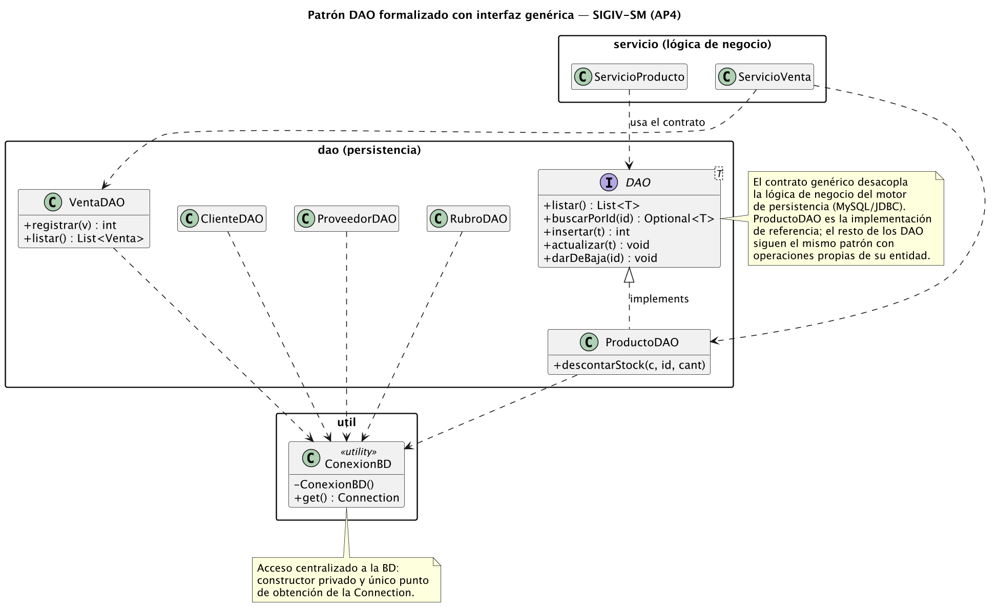
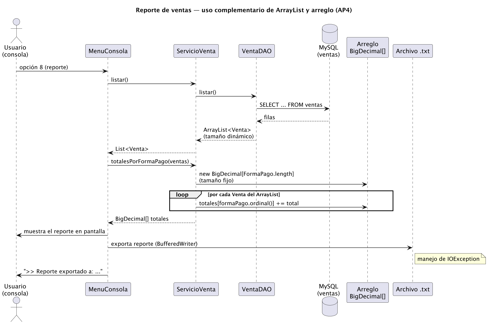

# Introducción

Este documento constituye la **cuarta y última entrega (AP4)** del proyecto **SIGIV-SM — Sistema de Gestión de Inventario y Ventas para Ferretería San Martín**, desarrollado a lo largo de la materia *Seminario de Práctica Informática* de la Licenciatura en Informática (Universidad Empresarial Siglo 21). Es la versión **final integradora**: cierra el ciclo iniciado en AP1 (análisis del modelo de negocio, requerimientos y casos de uso), continuado en AP2 (modelos de análisis y diseño del Proceso Unificado de Desarrollo, base de datos MySQL y plan de pruebas) y AP3 (aplicación concreta de la Programación Orientada a Objetos sobre Java).

Para que la lectura siga un orden lógico, organicé el informe en cuatro bloques. **Primero** retomo de forma sintética el problema y los objetivos del proyecto, ya redepurados a partir de la devolución docente. **Segundo** detallo cómo incorporé las observaciones recibidas en las entregas anteriores, porque la consigna del AP4 lo pide explícitamente y porque ese fue mi punto de partida para esta iteración. **Tercero** desarrollo el núcleo técnico que evalúa esta actividad: la selección y justificación del **patrón de diseño DAO**, la **persistencia en MySQL** (conexión, consulta, actualización y presentación de resultados), el **manejo de excepciones** asociado, el uso de **interfaces y clases abstractas**, y el empleo **complementario de arreglos y `ArrayList`**, sumando el uso opcional de **archivos**. **Cuarto** presento la evidencia de compilación y ejecución, la trazabilidad con la consigna y las conclusiones.

Mantuve la lógica de **entrega incremental** propia del PUD: no reescribí el sistema, sino que sumé una iteración de construcción sobre el prototipo existente, cuidando que todo lo que ya funcionaba (interfaz Swing, menú de consola, módulos de Seguridad, Inventario y Ventas) siguiera compilando y comportándose igual.

**Repositorio GitHub (código completo y archivos asociados):** https://github.com/cirola/sigiv-ferreteria

---

# 1. Síntesis del proyecto

## 1.1. La organización y el problema

**Ferretería San Martín** es un comercio minorista de barrio en Córdoba capital, con 15 años de trayectoria, 3 empleados y un catálogo de aproximadamente 2.000 productos. Su operatoria es manual: las ventas se registran en talonario, el stock se anota en planillas que rara vez están al día y las cuentas corrientes de los clientes se llevan en un cuaderno. Esa forma de trabajar genera tres problemas concretos que el dueño identifica a diario: **quiebres de stock** (se vende lo que no hay o se acumula lo que no rota), **errores de facturación** (precios desactualizados, sumas a mano) y **ausencia total de reportes** para tomar decisiones de compra.

## 1.2. Objetivos (redefinidos)

A partir de la devolución de AP1 separé con cuidado tres niveles que antes tendían a mezclarse, y redacté los objetivos como **logros** (el *qué*) y no como etapas de desarrollo (el *cómo*):

**Objetivo general del proyecto.** Dotar a Ferretería San Martín de un sistema informático que reemplace el registro manual por uno digital e integrado, de modo que el comercio gane control sobre su inventario y sus ventas y reduzca los errores operativos.

**Objetivos específicos (planteados como logros):**

- Lograr que el stock refleje en todo momento la realidad del depósito, actualizándose automáticamente con cada venta.
- Lograr ventas registradas sin errores de precio ni de cálculo, con comprobante y trazabilidad.
- Lograr el control de las cuentas corrientes de los clientes con límite de crédito y saldo siempre actualizado.
- Lograr información de gestión disponible (productos bajo stock mínimo, facturación por forma de pago) para apoyar las decisiones de compra.

**Objetivo del sistema (lo que el sistema hace, no lo que persigue la organización).** SIGIV-SM autentica usuarios según su rol, administra el catálogo de productos y su stock, registra ventas de forma transaccional descontando el stock e impactando la cuenta corriente cuando corresponde, y produce reportes de inventario y de ventas.

**Límites del sistema (Desde / Hasta).** *Desde* el ingreso del usuario al sistema (login). *Hasta* la registración de la venta con su impacto en stock y cuenta corriente, y la emisión de los reportes de gestión. Quedan **fuera del alcance** de este prototipo —y por lo tanto pertenecen al contexto, no al sistema— la facturación electrónica ante AFIP, el módulo de compras a proveedores y la contabilidad general.

## 1.3. Marco tecnológico y arquitectura

| Aspecto | Definición |
|---|---|
| **Lenguaje** | Java 17+ (probado en JDK 21). |
| **Persistencia** | MySQL 8/9 vía JDBC. |
| **Construcción** | Maven. |
| **Interfaz** | Swing (gráfica) y menú de consola. |
| **Seguridad** | Hash de contraseñas con jBCrypt. |
| **Arquitectura** | Tres capas: presentación / lógica de negocio / persistencia. |
| **Patrones** | **DAO** (protagonista de esta entrega), con MVC, Singleton y Strategy como complementarios. |
| **Entregable** | Prototipo operacional, en el sentido de Kendall & Kendall (2011): "un modelo operacional que incluye solo algunas características del sistema final". |

Esta entrega se inscribe en la disciplina de **Implementación** del PUD, con foco en la calidad del diseño y en la persistencia.

---

# 2. Corrección de observaciones de las entregas anteriores

La consigna del AP4 pide partir de las correcciones previas. A continuación detallo cada observación de Fernando y qué hice con ella; este fue, honestamente, el insumo que más me ordenó el trabajo.

## 2.1. Observaciones sobre AP1 (análisis)

| Observación recibida | Acción correctiva en AP4 |
|---|---|
| Los **objetivos específicos** deben redactarse como **logros**, no como etapas del desarrollo de software, y no mezclarse con los del sistema o los de la organización. | Reescribí la sección 1.2 separando explícitamente *objetivo del proyecto*, *objetivos específicos como logros*, *objetivo del sistema* y *objetivos de la organización*. Cada específico ahora empieza con "Lograr…". |
| El **objetivo** debe expresar **qué** se quiere lograr, sin confundirlo con el del sistema ni con el de la organización. | Distinguí los tres niveles en párrafos separados (1.2). |
| Los **límites** deben definirse en términos **Desde / Hasta**, separando el sistema de su contexto. | Reformulé los límites con ese formato y listé explícitamente lo que queda fuera de alcance (contexto). |
| Las **fichas de casos de uso** son material de trabajo del desarrollador: importa la descripción detallada y los elementos UML. | Las fichas siguen disponibles en `docs/` del repositorio; en esta entrega su valor se ve materializado en el código, ya que los flujos de "Registrar venta" y "Consultar inventario" descriptos en esas fichas son exactamente los que implementé y demuestro en las secciones 4 y 5. |

## 2.2. Observaciones sobre AP3 (POO en Java)

Fernando marcó que *"la explicación de las partes de código es básica"* y que, si bien el uso de IA como herramienta es válido, **el desarrollo y la documentación deben tener mi impronta**. Tomé esa observación como la más importante para esta entrega y actué en dos planos:

1. **En la redacción.** En lugar de describir el código de forma genérica ("este método ordena una lista"), en este informe explico *por qué* tomé cada decisión, qué alternativas descarté y cómo se conecta con el dominio de la ferretería. Por ejemplo, en la sección 7 no me limito a decir que uso un arreglo: justifico por qué un arreglo de tamaño fijo es la estructura correcta para acumular por forma de pago y por qué la `ArrayList` lo es para la fuente de datos.

2. **En el código.** Las incorporaciones de esta entrega (la interfaz `DAO<T>`, el reporte por forma de pago y la exportación a archivo) las pensé yo a partir de necesidades reales del negocio —el dueño quiere saber cuánto facturó en efectivo, por transferencia y a cuenta corriente—, y los comentarios del código explican el razonamiento, no solo la mecánica.

> Nota: respecto del AP2, la devolución que tengo registrada no contenía observaciones de fondo sobre el análisis y diseño, por lo que mantuve los modelos de ese trabajo (DER, diagrama de clases, arquitectura) sin cambios estructurales, integrándolos a esta versión final.

---

# 3. Selección y justificación del patrón de diseño: DAO

## 3.1. Por qué DAO y no otro

La consigna pide **elegir un patrón** coherente con la arquitectura ya definida. Desde AP2 el sistema está organizado en tres capas, y el problema recurrente de cualquier sistema de gestión es el mismo: **el código de negocio no debería tener que saber cómo se guardan los datos**. Si la lógica de "registrar una venta" tuviera mezcladas las sentencias SQL, cualquier cambio en la base (una columna nueva, otro motor) obligaría a tocar la lógica, y el código sería imposible de probar sin una base real.

El patrón **DAO (Data Access Object)** resuelve exactamente eso: **encapsula y aísla el acceso a la fuente de datos** detrás de una interfaz orientada al dominio. Evalué brevemente otras opciones antes de decidir:

- **Singleton** lo uso, pero solo gobierna el acceso a la conexión (`ConexionBD`); no estructura la persistencia.
- **Strategy** también está presente (los `Comparator` intercambiables de ordenamiento), pero resuelve un problema puntual de ordenación, no la arquitectura de datos.
- **DAO** es el único que estructura **toda** la capa de persistencia y es el que mejor dialoga con la arquitectura en tres capas que vengo sosteniendo. Por eso lo elegí como patrón **protagonista** de esta entrega.

## 3.2. Cómo lo formalicé en esta entrega

En AP2 los DAO existían como clases sueltas (`ProductoDAO`, `ClienteDAO`, etc.), pero no había un **contrato común** que los unificara. En AP4 di ese paso: creé la interfaz genérica `dao.DAO<T>`, que define las operaciones de acceso a datos que comparte cualquier entidad del dominio.

```java
public interface DAO<T> {
    List<T> listar() throws SQLException;
    Optional<T> buscarPorId(int id) throws SQLException;
    int insertar(T entidad) throws SQLException;
    void actualizar(T entidad) throws SQLException;
    void darDeBaja(int id) throws SQLException;
}
```

Tomé tres decisiones de diseño concretas en esta interfaz:

- **La hice genérica (`<T>`)** para que el mismo contrato sirva a `Producto`, `Cliente` o cualquier entidad futura sin duplicar la firma de los métodos: esto es reutilización real, no declarativa.
- **Declaré `throws SQLException` en el contrato**, no en la implementación. Así la abstracción reconoce que el acceso a datos puede fallar, pero no revela *con qué tecnología* (es una excepción estándar de JDBC, no de un driver puntual).
- **Usé `Optional<T>` en `buscarPorId`** en lugar de devolver `null`, para que quien consume el DAO esté obligado a contemplar el caso "no existe" y no se le escape un `NullPointerException`.

`ProductoDAO` es la **implementación de referencia** y declara `implements DAO<Producto>`. El resto de los DAO siguen el mismo patrón y agregan operaciones propias de su entidad (por ejemplo, `VentaDAO.registrar()` ejecuta una transacción, y `ClienteDAO.registrarMovimiento()` impacta la cuenta corriente). La siguiente figura resume la estructura.



*Figura 1 — La interfaz `DAO<T>` formaliza el patrón: desacopla la capa de servicios del motor de persistencia. `ProductoDAO` es la implementación de referencia; todos los DAO obtienen la conexión a través del acceso centralizado `ConexionBD`.*

El beneficio es tangible: la capa de servicio (`ServicioProducto`, `ServicioVenta`) programa contra el comportamiento de "un DAO", no contra MySQL. Si mañana la ferretería migrara a PostgreSQL, bastaría con escribir otra implementación de `DAO<Producto>` sin tocar una sola línea de la lógica de negocio.

---

# 4. Persistencia y consulta de datos en MySQL

La persistencia es el corazón de esta actividad. El prototipo cubre el ciclo completo que pide la consigna: **establecer la conexión, consultar, actualizar registros y presentar los resultados en la interfaz**. Lo recorro con código real del proyecto.

## 4.1. Establecer la conexión (de forma centralizada)

Todo el acceso a la base pasa por una única clase, `util.ConexionBD`. La diseñé como un punto de acceso centralizado: tiene el **constructor privado** (nadie puede instanciarla por error) y lee las credenciales una sola vez, desde `config.properties`, en un bloque estático. De ese modo, ningún DAO conoce ni el usuario ni la contraseña de la base: solo piden una conexión.

```java
public final class ConexionBD {
    private static String url, user, password;

    static {   // se ejecuta una vez, al cargar la clase
        try (InputStream in = ConexionBD.class.getClassLoader()
                .getResourceAsStream("config.properties")) {
            Properties p = new Properties();
            p.load(in);
            url = p.getProperty("db.url");
            user = p.getProperty("db.user");
            password = p.getProperty("db.password");
        } catch (IOException e) {
            throw new IllegalStateException("Error leyendo config.properties", e);
        }
    }

    private ConexionBD() {}

    public static Connection get() throws SQLException {
        return DriverManager.getConnection(url, user, password);
    }
}
```

## 4.2. Consultar (lectura con `PreparedStatement`)

Las consultas siempre se hacen con `PreparedStatement` y parámetros (`?`), nunca concatenando texto del usuario en el SQL. Esa decisión no es estética: es lo que evita la **inyección SQL**, un riesgo de seguridad concreto en un sistema que recibe códigos y textos tipeados por un vendedor. La búsqueda de productos lo muestra:

```java
public List<Producto> buscar(String texto) throws SQLException {
    String sql = SELECT_BASE +
            "WHERE p.activo = TRUE AND (p.codigo LIKE ? OR p.descripcion LIKE ?) " +
            "ORDER BY p.descripcion";
    String like = "%" + texto + "%";
    try (Connection c = ConexionBD.get();
         PreparedStatement ps = c.prepareStatement(sql)) {
        ps.setString(1, like);
        ps.setString(2, like);
        try (ResultSet rs = ps.executeQuery()) {
            return mapear(rs);   // ResultSet -> List<Producto>
        }
    }
}
```

Uso *try-with-resources* en cada operación: `Connection`, `PreparedStatement` y `ResultSet` se cierran solos al salir del bloque, aun si ocurre una excepción. Es la forma correcta de no filtrar conexiones, un problema clásico cuando la base se usa mucho.

## 4.3. Actualizar registros

La actualización de un producto es directa, pero el caso más representativo es el **descuento de stock**, porque resuelve una condición de carrera con una sola sentencia: descuenta *y* valida disponibilidad a la vez, gracias a la condición `stock_actual >= ?`.

```java
public void descontarStock(Connection c, int productoId, int cantidad) throws SQLException {
    String sql = "UPDATE productos SET stock_actual = stock_actual - ? " +
            "WHERE id = ? AND stock_actual >= ?";
    try (PreparedStatement ps = c.prepareStatement(sql)) {
        ps.setInt(1, cantidad);
        ps.setInt(2, productoId);
        ps.setInt(3, cantidad);
        int filas = ps.executeUpdate();
        if (filas == 0) {   // no se actualizó nada -> no había stock suficiente
            throw new SQLException("Stock insuficiente para producto id=" + productoId);
        }
    }
}
```

Este método recibe la `Connection` como parámetro a propósito: así puede ejecutarse **dentro de la transacción** de la venta (sección 4.4) y no en una conexión aparte.

## 4.4. Operación transaccional: registrar una venta

Registrar una venta toca varias tablas (`ventas`, `detalle_ventas`, `productos`, `movimientos_cta_cte`, `bitacora`). O se hacen **todas** las operaciones o **ninguna**: si en mitad del proceso un producto no tiene stock, no puede quedar la cabecera de la venta grabada a medias. Por eso `VentaDAO.registrar()` desactiva el *auto-commit*, agrupa todo y hace `commit()` al final; ante cualquier `SQLException`, hace `rollback()`.

```java
public int registrar(Venta v) throws SQLException {
    Connection c = ConexionBD.get();
    try {
        c.setAutoCommit(false);
        // ... INSERT en ventas, INSERT batch de detalle_ventas + descontarStock,
        //     movimiento de cta. cte. si corresponde, e INSERT en bitacora ...
        c.commit();
        return ventaId;
    } catch (SQLException e) {
        try { c.rollback(); } catch (SQLException ignored) {}
        throw e;   // se re-lanza para que la capa superior la informe
    } finally {
        try { c.setAutoCommit(true); c.close(); } catch (SQLException ignored) {}
    }
}
```

## 4.5. Presentar los resultados en la interfaz

Los datos consultados se muestran tanto en la **interfaz gráfica Swing** (paneles de productos y de venta) como en el **menú de consola**. Por ejemplo, el listado de productos llega como `List<Producto>` desde el servicio y se imprime formateado en columnas; el reporte de la sección 7 se muestra en pantalla y, además, se exporta a un archivo. La regla que respeté en toda la aplicación es que la presentación **nunca** habla con la base: pide los datos a la capa de servicio, que a su vez delega en los DAO.

---

# 5. Manejo de excepciones en la interacción con la base de datos

Diseñé el tratamiento de errores distinguiendo dos mundos que no conviene confundir: los **errores de infraestructura** (la base de datos) y los **errores de negocio** (reglas del dominio).

- **Infraestructura.** Las operaciones JDBC declaran `throws SQLException`. No la "trago" en los DAO: la dejo subir hasta la capa de presentación, que es la única que sabe cómo comunicarle el problema al usuario. En la transacción de venta, además, la capturo solo para poder hacer `rollback()` y la **vuelvo a lanzar**, de modo que el dato de que algo falló no se pierde.

- **Negocio.** Para las reglas propias del dominio creé una jerarquía de excepciones (`ValidacionException`, `StockInsuficienteException`, `CreditoExcedidoException`, `EntidadNoEncontradaException`). Esto me permite, en la interfaz, dar mensajes precisos según el tipo de problema:

```java
try {
    switch (opcion) { /* ... operaciones que pueden tocar la BD ... */ }
} catch (SQLException e) {
    System.out.println("[ERROR BD] " + e.getMessage());      // infraestructura
} catch (ValidacionException e) {
    System.out.println("[VALIDACIÓN] " + e.getMessage());    // negocio
}
```

A esto sumé, en esta entrega, el manejo de **`IOException`** en la exportación del reporte a archivo (sección 7), con la misma filosofía: si el disco falla o no hay permisos, el programa lo informa y sigue funcionando, no se cae.

---

# 6. Clases abstractas e interfaces

La consigna pide usar clases abstractas **o** interfaces; en SIGIV-SM uso **ambas**, cada una donde corresponde conceptualmente.

- **Clase abstracta `modelo.Persona`** (incorporada en AP3). Modela lo común a clientes y proveedores —son entidades de contacto con nombre, documento y datos de contacto— pero **no tiene sentido instanciar una "Persona" genérica**. Por eso es abstracta y declara métodos abstractos (`tipoEntidad()`, `fichaResumen()`) que cada subclase completa. La clase abstracta es la herramienta correcta aquí porque hay **estado y comportamiento compartido** que conviene heredar (no solo un contrato).

- **Interfaz `dao.DAO<T>`** (incorporada en AP4). Define un **contrato puro de comportamiento**, sin estado: "esto es lo que sabe hacer un objeto de acceso a datos". La interfaz es lo correcto aquí porque los distintos DAO no comparten implementación entre sí (cada uno arma su propio SQL), solo comparten la *forma* de ser usados.

La diferencia no es casual: usé **clase abstracta cuando hay implementación que compartir** (Persona) e **interfaz cuando solo hay un contrato que cumplir** (DAO). Ese criterio es el que justifica que el sistema use las dos herramientas y no una sola por inercia.

---

# 7. Uso complementario de arreglos y `ArrayList`

La consigna pide usar arreglos **y** `ArrayList` de forma **complementaria**. Para que ese uso fuera genuino y no un ejemplo forzado, lo apoyé en una necesidad real: el dueño de la ferretería quiere saber **cuánto facturó según cada forma de pago** (efectivo, transferencia, cuenta corriente). Implementé ese reporte en `ServicioVenta.totalesPorFormaPago()`.

```java
public BigDecimal[] totalesPorFormaPago(List<Venta> ventas) {
    Venta.FormaPago[] formas = Venta.FormaPago.values();   // arreglo de tamaño fijo
    BigDecimal[] totales = new BigDecimal[formas.length];  // arreglo de acumuladores
    Arrays.fill(totales, BigDecimal.ZERO);

    for (Venta v : ventas) {                               // recorre el ArrayList
        int i = v.getFormaPago().ordinal();                // índice en el arreglo
        totales[i] = totales[i].add(v.getTotal());
    }
    return totales;
}
```

Acá las dos estructuras conviven porque cada una es la adecuada para su rol, y esa es la idea de "complementario":

- **`ArrayList<Venta>`** para la **fuente de datos**. No sé de antemano cuántas ventas hay en la base —pueden ser 10 o 10.000—, así que necesito una colección **dinámica**, que crece según lo que devuelva la consulta. Esa lista la arma `VentaDAO.listar()`.

- **Arreglo `BigDecimal[]`** para los **acumuladores**. Las formas de pago son un conjunto **fijo y conocido** (las define el `enum FormaPago`), así que un arreglo de tamaño exacto, indexado por el `ordinal()` de cada forma, es más simple y más eficiente que una colección dinámica: no necesito que crezca, necesito exactamente una celda por categoría.

El flujo completo —de la `ArrayList` traída de la base, a la acumulación en el arreglo, a la presentación y exportación— se ve en la figura siguiente.



*Figura 2 — La consulta devuelve un `ArrayList<Venta>` de tamaño dinámico; el servicio acumula sobre un arreglo de tamaño fijo indexado por forma de pago; el resultado se muestra en pantalla y se persiste en un archivo de texto.*

> Vale aclarar que `ArrayList` ya se usaba en todo el sistema desde AP2/AP3 (ítems de una venta, listas de productos, agenda polimórfica de contactos). Lo que aporta esta entrega es el **arreglo trabajando junto a la lista** en un mismo caso de uso.

---

# 8. Uso de archivos (actividad opcional)

La consigna marca el uso de archivos como opcional, pero quise practicarlo de cara al EFIP I y, además, le encontré una utilidad concreta: que el reporte de ventas quede **guardado** para imprimirlo o adjuntarlo, no solo visible en pantalla. Cuando el usuario ejecuta la opción 8 del menú, el reporte se exporta a un archivo de texto con marca de tiempo en su nombre.

```java
private void exportarReporte(String contenido) {
    try {
        Path dir = Paths.get("reportes");
        Files.createDirectories(dir);
        String nombre = "ventas-" +
                LocalDateTime.now().format(DateTimeFormatter.ofPattern("yyyyMMdd-HHmmss")) + ".txt";
        Path archivo = dir.resolve(nombre);
        try (BufferedWriter w = Files.newBufferedWriter(archivo, StandardCharsets.UTF_8)) {
            w.write(contenido);
        }
        System.out.println(">> Reporte exportado a: " + archivo.toAbsolutePath());
    } catch (IOException e) {
        System.out.println("[ERROR ARCHIVO] No se pudo guardar el reporte: " + e.getMessage());
    }
}
```

Decisiones que tomé: crear la carpeta `reportes/` si no existe (`Files.createDirectories`), nombrar cada archivo con fecha y hora para no pisar reportes anteriores, escribir en **UTF-8** para que los acentos y el símbolo `$` salgan bien, usar *try-with-resources* para cerrar el `BufferedWriter`, y **capturar `IOException`** para que un problema de escritura no interrumpa la aplicación.

---

# 9. Compilación y ejecución (evidencia)

El proyecto **compila y se ejecuta** con Maven y JDK 21.

```bash
# 1) Base de datos
mysql -u root < database/schema.sql
mysql -u root < database/datos-iniciales.sql

# 2) Compilar y empaquetar
mvn clean package

# 3) Ejecutar
java -jar target/sigiv-ferreteria.jar            # interfaz gráfica (Swing)
java -jar target/sigiv-ferreteria.jar --consola  # menú de consola (incluye el reporte AP4)
```

La compilación de esta entrega finaliza en `BUILD SUCCESS`. El menú de consola incorpora la nueva opción 8:

```
------------- MENÚ PRINCIPAL -------------
 1) Listar productos
 2) Buscar producto por código (búsqueda binaria)
 3) Ordenar productos (QuickSort)
 4) Productos bajo stock mínimo
 5) Registrar venta
 6) Alta de producto
 7) Agenda de contactos (clientes y proveedores)
 8) Reporte de ventas por forma de pago (exporta a archivo)
 0) Salir
-----------------------------------------
```

Salida representativa del reporte (opción 8), que combina el `ArrayList` de ventas con el arreglo de acumuladores y se guarda en archivo:

```
REPORTE DE VENTAS POR FORMA DE PAGO
Generado: 28/06/2026 18:40
Ventas confirmadas procesadas: 7
-------------------------------------------
EFECTIVO         $    45.300,00
TRANSFERENCIA    $    18.750,00
CTA_CTE          $    37.000,00
-------------------------------------------
TOTAL GENERAL    $   101.050,00
>> Reporte exportado a: /.../reportes/ventas-20260628-184012.txt
```

El **smoke test** de AP2 (`com.sigiv.util.SmokeTest`) sigue pasando tras los cambios, lo que confirma que la nueva iteración no rompió el comportamiento previo (login, listado, venta en efectivo con descuento de stock, venta a cuenta corriente con actualización de saldo y rechazo por stock insuficiente).

---

# 10. Trazabilidad con la consigna del AP4

| Requisito de la consigna | Dónde se cumple |
|---|---|
| Corrección de las observaciones previas | Sección 2 (AP1 y AP3). |
| Selección del patrón de diseño y justificación | Sección 3; interfaz `dao.DAO<T>`, Figura 1. |
| Persistencia y consulta en MySQL (conexión, consulta, actualización, presentación) | Sección 4; `ConexionBD`, DAO, `VentaDAO.registrar`. |
| Correcta aplicación de excepciones para la BD | Sección 5; `SQLException`, rollback, multi-catch. |
| Inclusión pertinente de clases abstractas o interfaces | Sección 6; `Persona` (abstracta) y `DAO<T>` (interfaz). |
| Uso complementario de arreglos y `ArrayList` | Sección 7; `totalesPorFormaPago`, Figura 2. |
| Uso de archivos (opcional) | Sección 8; `exportarReporte`. |
| Java como lenguaje y MySQL para la persistencia | Todo el prototipo. |
| Aplicación del PUD (entrega incremental) | Secciones 1 y 2; iteración de Implementación sobre el prototipo. |
| Programa que compila y se ejecuta | Sección 9 (`BUILD SUCCESS` y salidas reales). |
| Enlace a GitHub | Portada e Introducción. |

---

# 11. Conclusiones

SIGIV-SM llega a su versión final integradora cumpliendo el objetivo que me había propuesto: convertir la operatoria manual de Ferretería San Martín en un sistema que controla inventario, ventas y cuentas corrientes con persistencia confiable en MySQL.

En lo técnico, esta entrega cierra el diseño eligiendo el **patrón DAO** como columna vertebral de la persistencia y formalizándolo con una **interfaz genérica** que desacopla la lógica de negocio del motor de base de datos. Sobre esa base, demostré el ciclo completo de persistencia (conexión centralizada, consultas parametrizadas, actualización transaccional con rollback y presentación en la interfaz), un **manejo de excepciones** que separa los errores de infraestructura de los de negocio, el uso conjunto de **clase abstracta e interfaz** según el criterio correcto para cada caso, y el empleo **complementario de arreglos y `ArrayList`** en un reporte real, con su exportación a **archivo**.

En lo personal, el aporte más importante de esta iteración fue tomar la devolución de Fernando sobre la profundidad de las explicaciones y la impronta propia: revisé objetivos y límites según lo señalado en AP1, y trabajé tanto el código como la documentación buscando justificar cada decisión desde el problema de la ferretería, no desde el ejemplo de manual. El sistema queda preparado para las iteraciones futuras previstas en el PUD —módulo de compras, reportes más ricos y la fase de Transición (despliegue y capacitación)—, manteniendo la base sólida y la coherencia arquitectónica construidas a lo largo de las cuatro entregas.

---

# Referencias

- Deitel, P., & Deitel, H. (2017). *Cómo programar en Java* (10a ed.). Pearson Educación.
- Gamma, E., Helm, R., Johnson, R., & Vlissides, J. (1995). *Design Patterns: Elements of Reusable Object-Oriented Software*. Addison-Wesley.
- Jacobson, I., Booch, G., & Rumbaugh, J. (2000). *El Proceso Unificado de Desarrollo de Software*. Addison-Wesley.
- Kendall, K., & Kendall, J. (2011). *Análisis y diseño de sistemas* (8a ed.). Pearson Education.
- Larman, C. (2004). *UML y patrones: una introducción al análisis y diseño orientado a objetos y al proceso unificado* (2a ed.). Pearson Education.
- Oracle Corporation. (2024). *The Java Tutorials — JDBC Database Access*. https://docs.oracle.com/javase/tutorial/jdbc/
- Oracle Corporation. (2024). *The Java Tutorials — Collections*. https://docs.oracle.com/javase/tutorial/collections/
